<h1 align="center">Hi , It's Imad</h1>
<h3 align="center">A Data Science student passionate about AI and Machine Learning</h3>

---

### 🚀 About Me

- 🎓 Data Science Student
- 💻 Interested in **AI**, **Data Science**, **Computer Vision**, and **Backend Development**
- 🤝 Open to collaborating on ML/AI projects and open-source work

---

### 🛠️ Tech Stack

  

---

### 📊 GitHub Stats

   

  

---

### 📌 Featured Projects

- **[Smart-Football-Analytics](https://github.com/mad88802/Smart-Football-Analytics)** — Web app for PCA, LDA & CA (Correspondence Analysis), built with Flask and powered by Groq AI, with Premier League player data scraped from FBref.
- **[Crypton-chat](https://github.com/mad88802/Crypton-chat)** — An animated cyberpunk messenger built with Flask and Socket.IO. Secures accounts with password hashing (scrypt) and protects messages in transit with simulated asymmetric encryption.
- **[Multi-Incident-Detection](https://github.com/mad88802/Multi-Incident-Detection)** — Real-time multi-hazard detection app for fire & smoke, garbage, and traffic incidents using YOLOv11, with a Flask + React dashboard, webcam inference, maps, and event stats.
- **[Genetic_Algorithm](https://github.com/mad88802/Genetic_Algorithm)** — A Genetic Algorithm feature selection tool built with Python and Streamlit, letting users dynamically tune hyperparameters (population, mutation, crossover) and visualize the optimization process.
